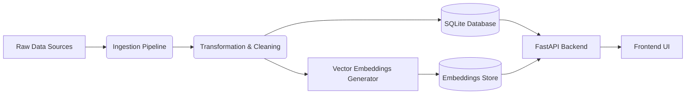

# Vertex-Valet

Vertex Valet is an intelligent book recommendation and search system designed to help users discover books using natural language. Unlike traditional search engines that rely on keyword matching, Vertex Valet utilizes semantic search to understand the *meaning* and *context* of your query.

Whether you're looking for a "sad story about a robot" or "a history of space exploration," Vertex Valet finds the most relevant books from a curated dataset of over 28,000 titles.


*(Screenshot of the application interface)*

---

## Key Features

*   **Semantic Search**: Powered by **Sentence Transformers** (`all-MiniLM-L6-v2`), enabling users to find books by describing plots, themes, or feelings.
*   **Hybrid Search Engine**: A smart combination of vector-based semantic search and traditional keyword matching (e.g., for specific authors), providing the best of both worlds.
*   **High-Performance API**: Built with **FastAPI** for asynchronous, low-latency responses.
*   **Modern Frontend**: A clean, responsive web interface featuring dynamic book cards, cover images, and interactive descriptions.
*   **End-to-End ETL Pipeline**: A complete data engineering workflow including ingestion, cleaning, transformation, and storage.
*   **Dockerized Deployment**: Fully containerized for easy deployment on platforms like Railway or Render.

---

## Architecture

The project follows a modular microservices-like architecture:



### Tech Stack

-   **Language**: Python 3.11
-   **Backend Framework**: FastAPI
-   **Database**: SQLite
-   **ML Model**: `distilbert-base-nli-stsb-mean-tokens` / `all-MiniLM-L6-v2`
-   **Vector Search**: Scikit-Learn (Cosine Similarity)
-   **Frontend**: Vanilla HTML5, CSS3, JavaScript
-   **Containerization**: Docker

---

## Installation & Local Setup

### Prerequisites
- Python 3.8+
- Docker (Optional, for containerized run)

### 1. Clone the Repository
```bash
git clone https://github.com/hetsoni1313/Vertex-valet.git
cd Vertex-valet
```

### 2. Set Up Virtual Environment
```bash
python -m venv venv
# Windows
.\venv\Scripts\activate
# Mac/Linux
source venv/bin/activate
```

### 3. Install Dependencies
```bash
pip install -r requirements.txt
```

### 4. Initialize Data & Model
Run the pipeline to build the database and generate embeddings (this processes ~28k books):
```bash
# Initialize Database
python pipeline.py --db

# Generate Semantic Embeddings (Downloads ML model)
python recommender/build_embeddings.py
```

### 5. Run the Application
Start the backend server (which also serves the frontend):
```bash
python pipeline.py --api
```
Access the application at: **[http://localhost:8000](http://localhost:8000)**

---

## Running with Docker

Vertex Valet is one-click deployable.

```bash
# Build the image
docker build -t vertex-valet .

# Run the container
docker run -p 8000:8000 vertex-valet
```

The Docker image automatically handles database initialization and model downloading during the build process to ensure fast startup times.

---

## Dataset Statistics

### Content Metrics
- **Raw Data Volume**: ~36,361 records
- **Processed Catalog**: ~28,503 unique books
- **Data Reduction**: ~21% filtered out (missing ISBNs or descriptions) to ensure quality.
- **Sources**: OpenLibrary, Google Books, Bookswagon.

### Technical Metrics
- **Vector Dimensions**: 384 (all-MiniLM-L6-v2 model)
- **Database Size**: ~45 MB (SQLite)
- **Embeddings Artifact**: ~80 MB (Optimized Pickle format)
- **Search Latency**: <100ms (Approximate on standard CPU)

---

## Contributors

<div align="center">

| Name | GitHub |
| :--- | :--- |
| **Gaurang Jadav** | [@gaurangjadav](https://github.com/GaUrAnGjJ) |
| **Het Katrodiya** | [@hetsoni1313](https://github.com/hetsoni1313) |


</div>

---

## Application Screenshots


*(Semantic search for "data scrapping")*


*(Rich results with book covers and descriptions)*

---

## License

This project is licensed under the MIT License.


